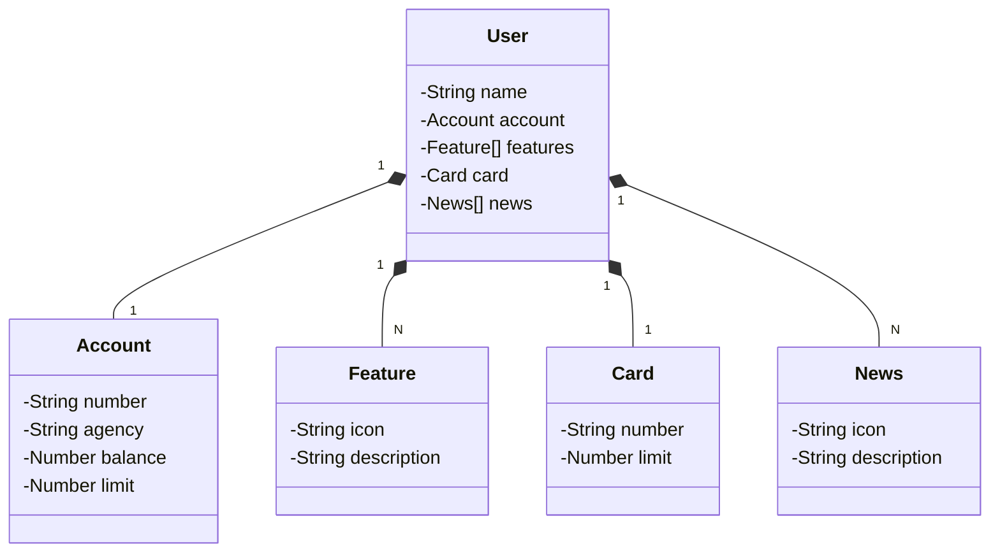

# RESTful API para domínio bancario conforme UX do figma a seguir

## [Link do Figma](https://www.figma.com/file/0ZsjwjsYlYd3timxqMWlbj/SANTANDER---Projeto-Web%2FMobile?type=design&node-id=1421%3A432&mode=design&t=6dPQuerScEQH0zAn-1)

## Diagrama de Classes (Domínio da API)

## IMPORTANTE

Este projeto foi replicado durante curso a DIO. Por isso, foi disponibilizado uma versão mais robusta dele no repositório oficial da DIO:

### [digitalinnovationone/santander-dev-week-2023-api](https://github.com/digitalinnovationone/santander-dev-week-2023-api)

Lá possui implementado todos os endpoints de CRUD, além de aplicar boas práticas (uso de DTOs e refinamento na documentação da OpenAPI). Sendo assim, o desafio/referência mais completo é só acessar lá👊🤩